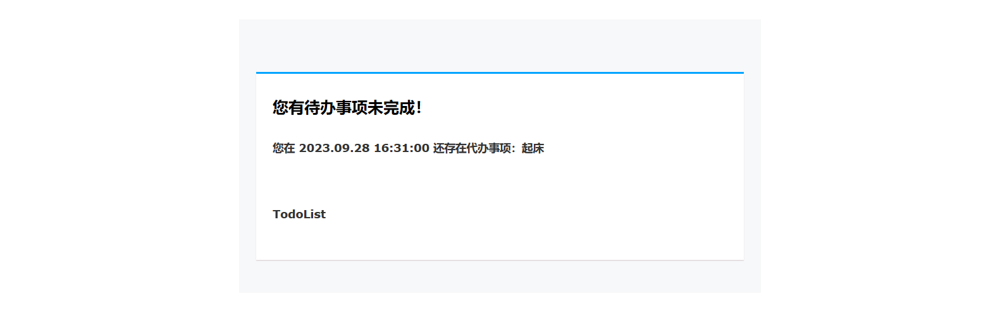

# TodoList

一个简单的任务管理器和待办清单应用。


## Deploy

将项目拉取之后使用docker-compose完成开发环境搭建。

```bash
  docker-compose up -d
```

之后直接运行api.go即可。
## API Reference

[api](https://github.com/muskonu/TodoList/blob/main/doc/api.md)


## Features

- 提供`once`, `daily`,`weekly`,`monthly`,`annually`等级别的重复提醒。
- 在到截止时间一个小时前发送邮件进行提醒。
- 以redis作低粒度缓存和建立索引为基础，mysql所有查询语句至少达到了`range`级别。


## Screenshots



## License

[MIT](https://choosealicense.com/licenses/mit/)